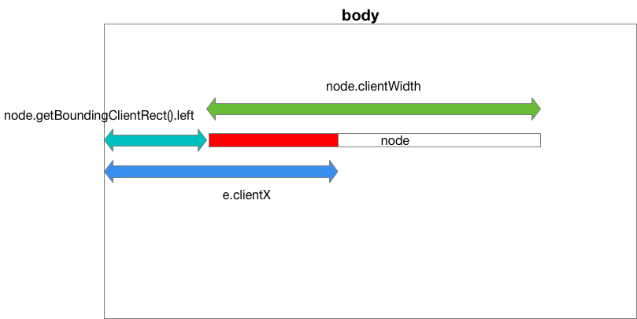

# music-player-by-react
音乐播放器

## 项目搭建

使用 create-react-app 创建项目，执行命令 `yarn run eject` 使内置的配置文件暴露出来，方便自定义。

1. 配置 LESS
2. 配置 CSS Modules

## 项目开发

### 音乐

使用 jPlayer 插件

```bash
yarn add jquery jPlayer
```

### 计算进度条



百分比计算：

```
const percent = (e.clientX - node.getBoundingClientRect().left) / node.clientWidth
```


## 参考

1. [Adding SASS or LESS support to create-react-app](https://medium.com/nulogy/how-to-use-css-modules-with-create-react-app-9e44bec2b5c2)
2. [How to Use CSS Modules with Create React App](https://medium.com/nulogy/how-to-use-css-modules-with-create-react-app-9e44bec2b5c2)